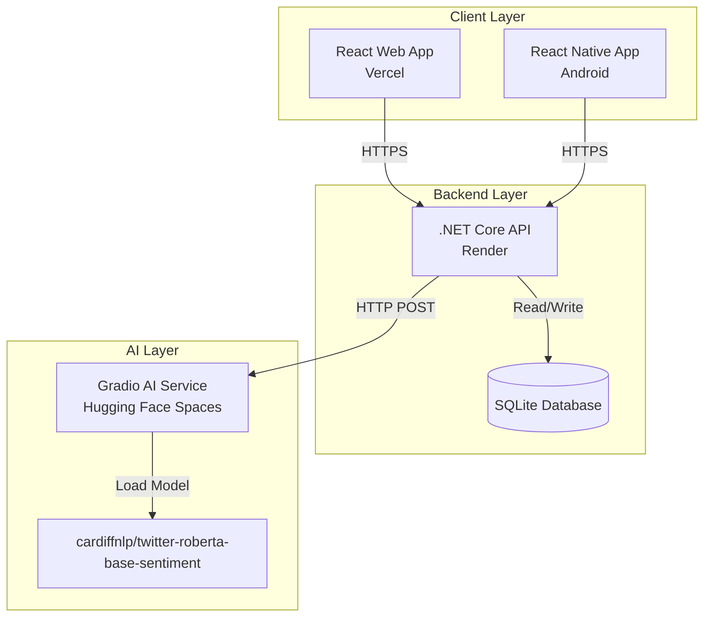

# Design Document

## Overview

Sentiment Chat App, üç katmanlı bir mimari kullanarak gerçek zamanlı duygu analizi yapan bir chat uygulamasıdır. Sistem, mikroservis yaklaşımıyla ayrılmış üç ana bileşenden oluşur:

1. **AI Service Layer**: Hugging Face Spaces üzerinde Python/Gradio ile geliştirilmiş duygu analiz servisi
2. **Backend Layer**: .NET Core 8.0 Web API, SQLite veritabanı ve Render deployment
3. **Frontend Layer**: React web uygulaması (Vercel) ve React Native mobil uygulama

Sistem, RESTful API prensiplerine uygun, stateless ve ölçeklenebilir bir yapıda tasarlanmıştır.

## Architecture

### System Architecture Diagram



### Communication Flow

1. **User Registration Flow**:
   - Client → Backend API (POST /api/users)
   - Backend validates and stores in SQLite
   - Backend returns user ID

2. **Message Sending Flow**:
   - Client → Backend API (POST /api/messages)
   - Backend → AI Service (POST /analyze)
   - AI Service returns sentiment
   - Backend stores message + sentiment in SQLite
   - Backend returns complete message object to client

3. **Message Retrieval Flow**:
   - Client → Backend API (GET /api/messages)
   - Backend queries SQLite
   - Backend returns message list with sentiment data

## Components and Interfaces

### 1. AI Service (Python/Gradio)

**Technology Stack**:
- Python 3.10+
- Gradio 4.x
- Transformers library
- Hugging Face Hub

**API Interface**:
```python
# Endpoint: POST /
# Request Body:
{
    "data": ["message text here"]
}

# Response:
{
    "data": [
        {
            "label": "POSITIVE",  # or NEGATIVE, NEUTRAL
            "score": 0.9876
        }
    ]
}
```

**Key Components**:
- `app.py`: Main Gradio application
- Model loader: Loads cardiffnlp/twitter-roberta-base-sentiment
- Sentiment analyzer: Processes text and returns classification
- Label mapper: Maps English labels to Turkish (POSITIVE→pozitif, NEGATIVE→negatif, NEUTRAL→nötr)

**Deployment Configuration**:
- Platform: Hugging Face Spaces
- Runtime: Python
- Requirements: gradio, transformers, torch

### 2. Backend API (.NET Core)

**Technology Stack**:
- .NET Core 8.0
- Entity Framework Core
- SQLite
- ASP.NET Core Web API

**Project Structure**:
```
backend/
├── Controllers/
│   ├── UsersController.cs
│   └── MessagesController.cs
├── Models/
│   ├── User.cs
│   ├── Message.cs
│   └── SentimentResult.cs
├── Data/
│   └── AppDbContext.cs
├── Services/
│   ├── ISentimentService.cs
│   └── SentimentService.cs
├── Program.cs
└── appsettings.json
```

**API Endpoints**:

```csharp
// Users Controller
POST   /api/users              // Register user
GET    /api/users/{id}         // Get user by ID
GET    /api/users              // Get all users

// Messages Controller  
POST   /api/messages           // Send message
GET    /api/messages           // Get all messages (with pagination)
GET    /api/messages/{id}      // Get message by ID

// Health
GET    /api/health             // Health check
```

**Request/Response Models**:

```csharp
// POST /api/users
public class CreateUserRequest
{
    public string Rumuz { get; set; }
}

public class UserResponse
{
    public int Id { get; set; }
    public string Rumuz { get; set; }
    public DateTime CreatedAt { get; set; }
}

// POST /api/messages
public class CreateMessageRequest
{
    public string Rumuz { get; set; }
    public string Text { get; set; }
}

public class MessageResponse
{
    public int Id { get; set; }
    public string Rumuz { get; set; }
    public string Text { get; set; }
    public string SentimentLabel { get; set; }  // pozitif/nötr/negatif
    public double? SentimentScore { get; set; }
    public DateTime CreatedAt { get; set; }
}
```

**Services**:

```csharp
public interface ISentimentService
{
    Task<SentimentResult> AnalyzeAsync(string text);
}

public class SentimentService : ISentimentService
{
    private readonly HttpClient _httpClient;
    private readonly string _aiServiceUrl;
    
    // Calls Hugging Face AI service
    // Handles errors and timeouts
    // Maps response to SentimentResult
}
```

**Deployment Configuration**:
- Platform: Render (Free Web Service)
- Build Command: `dotnet publish -c Release -o out`
- Start Command: `dotnet out/backend.dll`
- Environment Variables: AI_SERVICE_URL, DATABASE_PATH

### 3. Web Frontend (React)

**Technology Stack**:
- React 18
- Axios for HTTP requests
- CSS Modules or Tailwind CSS
- Vite or Create React App

**Component Structure**:
```
frontend/
├── src/
│   ├── components/
│   │   ├── ChatWindow.jsx
│   │   ├── MessageList.jsx
│   │   ├── MessageItem.jsx
│   │   ├── MessageInput.jsx
│   │   └── UserLogin.jsx
│   ├── services/
│   │   └── api.js
│   ├── App.jsx
│   └── main.jsx
├── public/
└── package.json
```

**Key Components**:

```jsx
// App.jsx - Main application
- Manages user state (rumuz)
- Routes between login and chat

// UserLogin.jsx
- Input for rumuz
- Calls POST /api/users
- Stores rumuz in state/localStorage

// ChatWindow.jsx
- Container for chat interface
- Fetches messages on mount
- Manages message state

// MessageList.jsx
- Displays array of messages
- Auto-scrolls to bottom

// MessageItem.jsx
- Displays single message
- Shows sentiment badge (pozitif/nötr/negatif)
- Color-coded by sentiment

// MessageInput.jsx
- Text input and send button
- Calls POST /api/messages
- Clears input after send
```

**API Service**:
```javascript
// services/api.js
const API_BASE_URL = process.env.REACT_APP_API_URL || 'http://localhost:5000';

export const api = {
    registerUser: (rumuz) => axios.post(`${API_BASE_URL}/api/users`, { rumuz }),
    sendMessage: (rumuz, text) => axios.post(`${API_BASE_URL}/api/messages`, { rumuz, text }),
    getMessages: (page = 1, pageSize = 50) => axios.get(`${API_BASE_URL}/api/messages`, { params: { page, pageSize } })
};
```

**Deployment Configuration**:
- Platform: Vercel
- Build Command: `npm run build`
- Output Directory: `dist` or `build`
- Environment Variables: REACT_APP_API_URL

### 4. Mobile App (React Native)

**Technology Stack**:
- React Native CLI
- Axios for HTTP requests
- React Navigation (optional)
- Native Base or React Native Paper (UI components)

**Component Structure**:
```
mobile/
├── src/
│   ├── screens/
│   │   ├── LoginScreen.js
│   │   └── ChatScreen.js
│   ├── components/
│   │   ├── MessageList.js
│   │   ├── MessageItem.js
│   │   └── MessageInput.js
│   ├── services/
│   │   └── api.js
│   └── App.js
├── android/
├── ios/
└── package.json
```

**Key Screens**:

```javascript
// LoginScreen.js
- TextInput for rumuz
- Button to register
- Navigation to ChatScreen

// ChatScreen.js
- FlatList for messages
- MessageInput component
- Pull-to-refresh functionality

// MessageItem.js
- View with message text
- Sentiment badge
- User rumuz display
```

**Build Configuration**:
- Android: `npx react-native run-android`
- APK Build: `cd android && ./gradlew assembleRelease`

## Data Models

### Database Schema (SQLite)

```sql
-- Users Table
CREATE TABLE Users (
    Id INTEGER PRIMARY KEY AUTOINCREMENT,
    Rumuz TEXT NOT NULL UNIQUE,
    CreatedAt DATETIME DEFAULT CURRENT_TIMESTAMP
);

-- Messages Table
CREATE TABLE Messages (
    Id INTEGER PRIMARY KEY AUTOINCREMENT,
    Rumuz TEXT NOT NULL,
    Text TEXT NOT NULL,
    SentimentLabel TEXT,
    SentimentScore REAL,
    CreatedAt DATETIME DEFAULT CURRENT_TIMESTAMP,
    FOREIGN KEY (Rumuz) REFERENCES Users(Rumuz)
);

-- Indexes
CREATE INDEX idx_messages_created_at ON Messages(CreatedAt);
CREATE INDEX idx_messages_rumuz ON Messages(Rumuz);
```

### Entity Models (.NET)

```csharp
public class User
{
    public int Id { get; set; }
    public string Rumuz { get; set; }
    public DateTime CreatedAt { get; set; }
    public ICollection<Message> Messages { get; set; }
}

public class Message
{
    public int Id { get; set; }
    public string Rumuz { get; set; }
    public string Text { get; set; }
    public string SentimentLabel { get; set; }
    public double? SentimentScore { get; set; }
    public DateTime CreatedAt { get; set; }
    public User User { get; set; }
}

public class SentimentResult
{
    public string Label { get; set; }
    public double Score { get; set; }
}
```

## Error Handling

### AI Service Error Handling

**Scenarios**:
1. Model loading failure → Return 500 with error message
2. Invalid input → Return 400 with validation error
3. Timeout → Return 504 Gateway Timeout

**Implementation**:
```python
try:
    result = classifier(text)
    return {"label": map_label(result[0]['label']), "score": result[0]['score']}
except Exception as e:
    return {"error": str(e)}, 500
```

### Backend API Error Handling

**Scenarios**:
1. AI Service unavailable → Store message with null sentiment, return 207 Multi-Status
2. Database error → Return 500 with generic error
3. Validation error → Return 400 with specific field errors
4. Duplicate rumuz → Return 409 Conflict

**Implementation**:
```csharp
public class ErrorResponse
{
    public string Message { get; set; }
    public Dictionary<string, string[]> Errors { get; set; }
}

// Global exception handler
app.UseExceptionHandler(errorApp =>
{
    errorApp.Run(async context =>
    {
        context.Response.StatusCode = 500;
        context.Response.ContentType = "application/json";
        var error = new ErrorResponse { Message = "An error occurred" };
        await context.Response.WriteAsJsonAsync(error);
    });
});
```

### Frontend Error Handling

**Scenarios**:
1. Network error → Show toast/alert with retry option
2. API error → Display error message from response
3. Validation error → Show inline field errors

**Implementation**:
```javascript
try {
    const response = await api.sendMessage(rumuz, text);
    setMessages([...messages, response.data]);
} catch (error) {
    if (error.response) {
        // API returned error
        alert(error.response.data.message);
    } else if (error.request) {
        // Network error
        alert('Bağlantı hatası. Lütfen tekrar deneyin.');
    }
}
```

## Testing Strategy

### AI Service Testing

**Unit Tests**:
- Test model loading
- Test sentiment classification with sample texts
- Test label mapping (English → Turkish)

**Integration Tests**:
- Test Gradio API endpoint
- Test response format
- Test error handling

**Tools**: pytest, unittest

### Backend API Testing

**Unit Tests**:
- Test validation logic
- Test sentiment service HTTP client
- Test data models

**Integration Tests**:
- Test API endpoints with in-memory database
- Test AI service integration with mocked responses
- Test CORS configuration

**Tools**: xUnit, Moq, Microsoft.AspNetCore.Mvc.Testing

```csharp
[Fact]
public async Task PostMessage_WithValidData_ReturnsMessageWithSentiment()
{
    // Arrange
    var client = _factory.CreateClient();
    var request = new CreateMessageRequest { Rumuz = "test", Text = "Great day!" };
    
    // Act
    var response = await client.PostAsJsonAsync("/api/messages", request);
    
    // Assert
    response.EnsureSuccessStatusCode();
    var message = await response.Content.ReadFromJsonAsync<MessageResponse>();
    Assert.NotNull(message.SentimentLabel);
}
```

### Frontend Testing

**Unit Tests**:
- Test component rendering
- Test user interactions
- Test API service functions

**Integration Tests**:
- Test complete user flows
- Test API integration with mocked backend

**Tools**: Jest, React Testing Library, MSW (Mock Service Worker)

```javascript
test('sends message when button clicked', async () => {
    render(<ChatWindow rumuz="test" />);
    const input = screen.getByPlaceholderText('Mesajınızı yazın...');
    const button = screen.getByText('Gönder');
    
    fireEvent.change(input, { target: { value: 'Hello!' } });
    fireEvent.click(button);
    
    await waitFor(() => {
        expect(screen.getByText('Hello!')).toBeInTheDocument();
    });
});
```

### Mobile App Testing

**Unit Tests**:
- Test component rendering
- Test navigation
- Test API integration

**Tools**: Jest, React Native Testing Library

**Manual Testing**:
- Test on Android emulator
- Test APK on physical device
- Test network conditions

## Security Considerations

1. **CORS Configuration**: Backend API must allow requests from Vercel domain and localhost
2. **Input Validation**: Sanitize all user inputs (rumuz, message text)
3. **Rate Limiting**: Implement rate limiting on API endpoints to prevent abuse
4. **SQL Injection**: Use parameterized queries (EF Core handles this)
5. **XSS Prevention**: React automatically escapes content
6. **HTTPS**: All production deployments use HTTPS

## Performance Considerations

1. **AI Service**: 
   - Model caching in memory
   - Response time target: < 5 seconds
   
2. **Backend API**:
   - Database indexing on CreatedAt and Rumuz
   - Pagination for message listing
   - Connection pooling for HTTP client
   
3. **Frontend**:
   - Lazy loading for message history
   - Debouncing for input
   - Optimistic UI updates

## Deployment Strategy

### Phase 1: AI Service
1. Create Hugging Face Space
2. Upload app.py and requirements.txt
3. Test endpoint
4. Note public URL

### Phase 2: Backend API
1. Push code to GitHub
2. Connect Render to repository
3. Configure environment variables
4. Deploy and test endpoints

### Phase 3: Frontend
1. Configure API URL in environment
2. Build production bundle
3. Deploy to Vercel
4. Test end-to-end flow

### Phase 4: Mobile
1. Configure API URL
2. Build Android APK
3. Test on emulator/device

## Design Decisions and Rationales

1. **SQLite vs PostgreSQL**: SQLite chosen for simplicity and Render free tier compatibility
2. **Gradio vs FastAPI**: Gradio chosen for quick deployment on Hugging Face Spaces
3. **Monorepo vs Separate Repos**: Monorepo chosen for easier management and documentation
4. **REST vs GraphQL**: REST chosen for simplicity and wide support
5. **Rumuz as Foreign Key**: Using rumuz (string) instead of user ID for simpler client implementation
